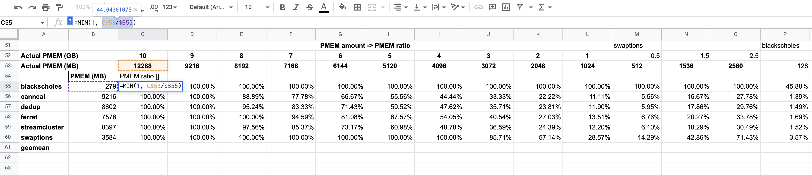

Use $ to fix column/row for autofilling.

Eg. C$53/$B55

>  You use a $ sign in front of the part that you want to remain constant, $A1 = constant column, A$1 = constant row, $A$1 = fixed position. You can quickly rotate through the various possibilities using the F4 function key. (On some computers, you may need to hold Fn and press the function key for it to work.)

Ref:

https://support.google.com/docs/thread/5225132/can-i-prevent-down-fill-from-incrementing-every-cell-reference-in-a-formula?hl=en
