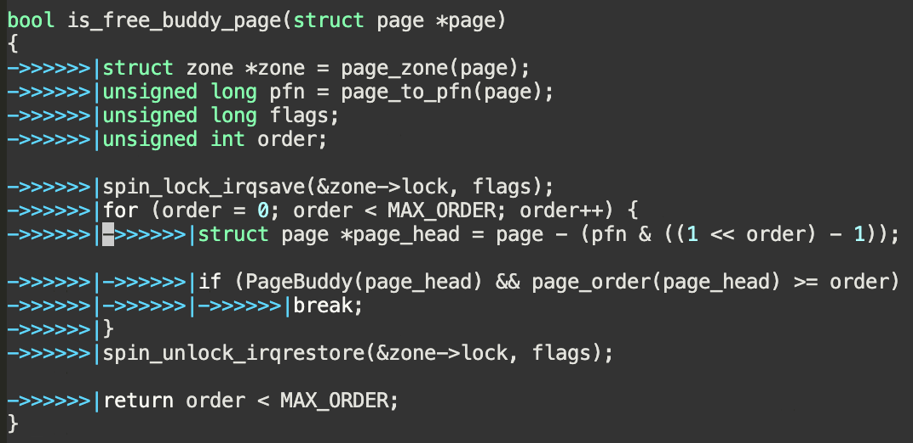
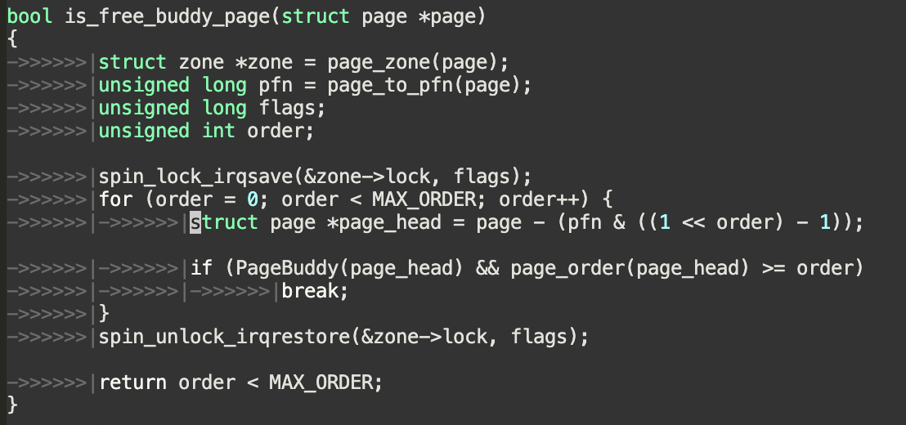
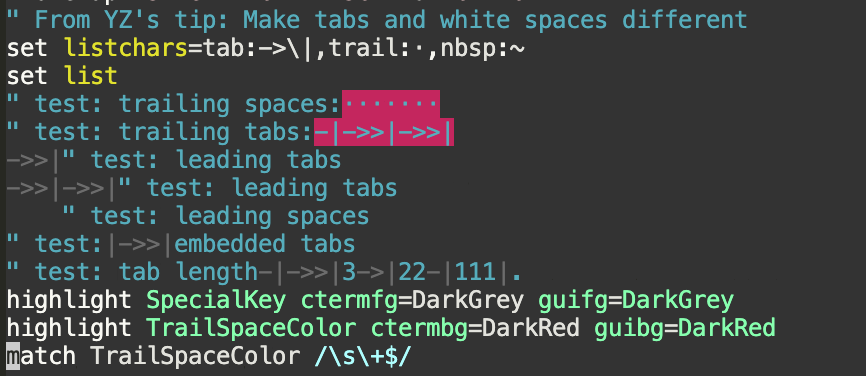

# Make tabs dimmer / Set tab color in vim

Displaying tabs using `listchar` makes tabs visible -- makes it different from
leading white spaces.  But that's too visible to stand.

I want to make it visible but more "transparent".

## TL;DR

Set the color for `SpecialKey` in vim since that's the color group for them.

```
highlight SpecialKey ctermfg=DarkGrey guifg=DarkGrey
```

||
|:--:|
|Before|
||
|After|

## Advanced

Highlight the trailing whitespaces!!

```
highlight TrailSpaceColor ctermbg=DarkRed guibg=DarkRed
match TrailSpaceColor /\s\+$/
```

||
|:--:|
|Trailing white spaces are highlighted as red|

## Refs
* https://stackoverflow.com/a/24233486
* https://vi.stackexchange.com/questions/6136/how-to-dim-characters-from-set-list
